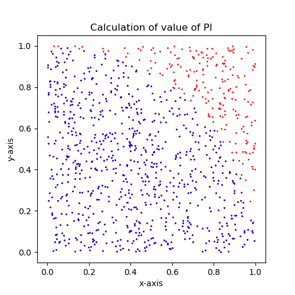
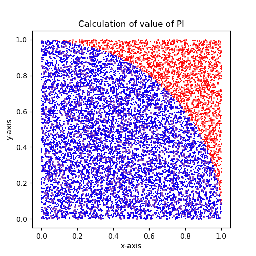
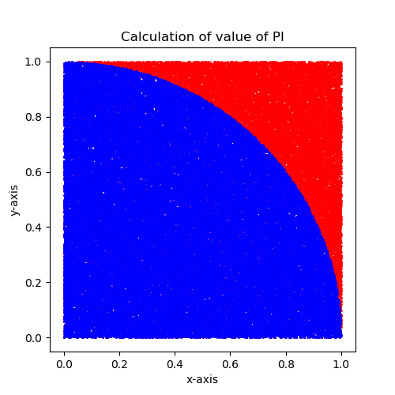
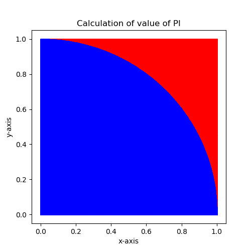

# Monte Carlo Simulation : Calculating value of PI
## Background:

*Content will be added here soon*

## Output:

`Case 1: n = 1000` 
`Estimated value of PI : 3.156`

`Case 1: n = 10000` 
`Estimated value of PI : 3.146`

`Case 1: n = 100000` 
`Estimated value of PI : 3.13068`

`Case 1: n = 1000000` 
`Estimated value of PI : 3.140032`

>For higher values of random points **n**, the estimate of PI will be more accurate.

